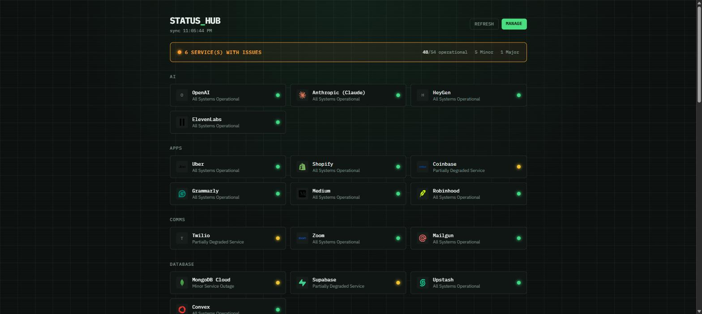

English | [Português](README.pt.md)

# Status Hub

Is GitHub down, or is it just you? Status Hub puts every status page you check into one grid: GitHub, Cloudflare, OpenAI, Discord, and 50+ others, refreshed automatically.

Pick the services you care about once; the selection is saved to `localStorage` so the
dashboard remembers you on the next visit. No account, no backend database.



## How it works

- `lib/providers.ts`: the catalog of supported services (name, category, Simple Icons
  slug, and the public status endpoint to poll).
- `app/api/status/route.ts`: a server-side proxy (`GET /api/status?ids=a,b,c`) that fetches
  each provider's status and normalizes it into one shape. Running server-side avoids CORS
  and keeps provider URLs out of the client bundle.
- `lib/normalize.ts`: adapters that map each provider's native response format
  (Statuspage.io's `api/v2/status.json`, or Google Cloud's `incidents.json`) into a common
  `{ indicator, description, updatedAt }` shape.
- `lib/useSelectedProviders.ts`: a `useSyncExternalStore`-backed hook that reads/writes the
  selection to `localStorage`, kept in sync across tabs.

Most providers here run on Statuspage.io, whose edge cache only refreshes every 10 seconds
(`s-maxage=10`). The dashboard polls every 12 seconds and the server-side fetch is cached
for 10 seconds, enough to stay current without hammering origins that gain nothing from
being asked more often.

## Getting started

```bash
npm install
npm run dev
```

Open [http://localhost:3000](http://localhost:3000). With nothing selected yet, you'll land
on the picker at `/select`.

## Scripts

```bash
npm run dev      # start the dev server
npm run build    # production build
npm run lint     # eslint
npm run test     # run the unit test suite once
npm run test:watch
```

## Adding a service

Most status pages are hosted on Statuspage.io and expose a public, unauthenticated
`https://<host>/api/v2/status.json` endpoint. To add one, append an entry to
`PROVIDERS` in `lib/providers.ts` with an `id`, `name`, `category`, `type: "statuspage"`,
its `baseUrl`, and a matching [Simple Icons](https://simpleicons.org) slug for the card
icon (the icon falls back to a letter avatar if the slug doesn't exist). Verify the
endpoint actually returns JSON before adding it: some status pages have moved to custom
SPAs that no longer serve a plain JSON API at that path.
