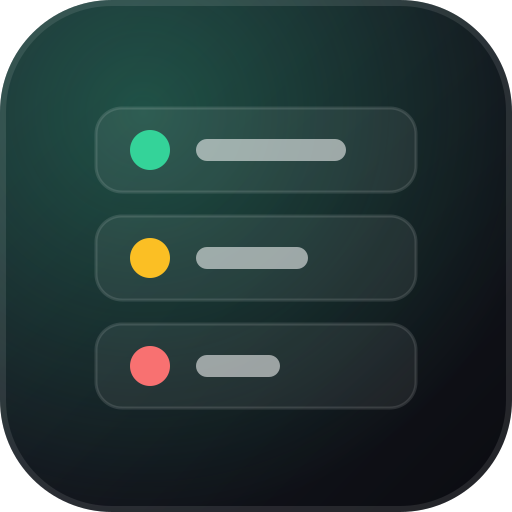
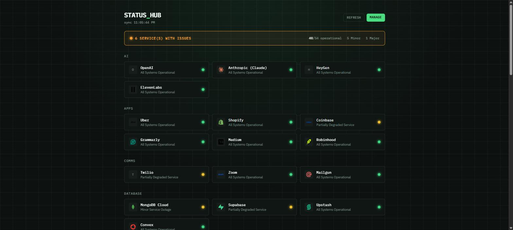

<div align="center">



# Status Hub

**Is GitHub down, or is it just you?**<br>
One grid for every status page you check: GitHub, Cloudflare, OpenAI, Discord and 50+ others, refreshed automatically.

[](https://status-hub-kappa.vercel.app)

[](https://github.com/obrenoalvim/status-hub/actions/workflows/ci.yml)
[](LICENSE)
[](https://github.com/obrenoalvim/status-hub/stargazers)
[](#how-it-works)

**English** · [Português](README.pt.md)

[How it works](#how-it-works) · [Getting started](#getting-started) · [Adding a service](#adding-a-service) · [FAQ](#faq)

</div>

---

Status Hub puts every status page you check into one grid: GitHub, Cloudflare, OpenAI, Discord, and 50+ others, refreshed automatically.

Pick the services you care about once; the selection is saved to `localStorage` so the
dashboard remembers you on the next visit. No account, no backend database.



## How it works

- `lib/providers.ts`: the catalog of supported services (name, category, Simple Icons
  slug, and the public status endpoint to poll).
- `app/api/status/route.ts`: a server-side proxy (`GET /api/status?ids=a,b,c`) that fetches
  each provider's status and normalizes it into one shape. Running server-side avoids CORS
  and keeps provider URLs out of the client bundle.
- `lib/normalize.ts`: adapters that map each provider's native response format
  (Statuspage.io's `api/v2/status.json`, or Google Cloud's `incidents.json`) into a common
  `{ indicator, description, updatedAt }` shape.
- `lib/useSelectedProviders.ts`: a `useSyncExternalStore`-backed hook that reads/writes the
  selection to `localStorage`, kept in sync across tabs.

Most providers here run on Statuspage.io, whose edge cache only refreshes every 10 seconds
(`s-maxage=10`). The dashboard polls every 12 seconds and the server-side fetch is cached
for 10 seconds, enough to stay current without hammering origins that gain nothing from
being asked more often.

## Getting started

```bash
npm install
npm run dev
```

Open [http://localhost:3000](http://localhost:3000). With nothing selected yet, you'll land
on the picker at `/select`.

## Environment variables

`NEXT_PUBLIC_SITE_URL`: the real deployed origin, used to build absolute URLs for
metadata, the sitemap, `robots.txt`, the OG image, JSON-LD, and `llms.txt` (see
`lib/site.ts`). Optional; falls back to `https://status-hub.vercel.app` if unset.

## Scripts

```bash
npm run dev      # start the dev server
npm run build    # production build
npm run lint     # eslint
npm run test     # run the unit test suite once
npm run test:watch
```

## Adding a service

Most status pages are hosted on Statuspage.io and expose a public, unauthenticated
`https://<host>/api/v2/status.json` endpoint. To add one, append an entry to
`PROVIDERS` in `lib/providers.ts` with an `id`, `name`, `category`, `type: "statuspage"`,
its `baseUrl`, and a matching [Simple Icons](https://simpleicons.org) slug for the card
icon (the icon falls back to a letter avatar if the slug doesn't exist). Verify the
endpoint actually returns JSON before adding it: some status pages have moved to custom
SPAs that no longer serve a plain JSON API at that path.

---

## FAQ

**Does it need an account or a database?**
No. Your selection is saved in `localStorage`, so the dashboard remembers you on the next visit. There is no account and no backend database.

**How often does it refresh?**
The dashboard polls every 12 seconds, and the server-side fetch is cached for 10 seconds. Most providers run on Statuspage.io, whose edge cache only refreshes every 10 seconds.

**Why does the app call its own API instead of the status pages directly?**
`/api/status` runs server-side, which avoids CORS and keeps provider URLs out of the client bundle.

**Can I add a service?**
Yes. Append an entry to `PROVIDERS` in `lib/providers.ts`. See [Adding a service](#adding-a-service).

## More web tools by the same author

- [**diff-viewer**](https://github.com/obrenoalvim/diff-viewer): compare two pieces of text and see what changed, in your browser.
- [**pdf-metadata-editor**](https://github.com/obrenoalvim/pdf-metadata-editor): edit a PDF's title, author and other details in your browser.
- [**linkedin-insights**](https://github.com/obrenoalvim/linkedin-insights): turn your LinkedIn analytics export into a dashboard.

## Contributing

Know a status page that belongs in the grid? Open an issue or a PR. See [CONTRIBUTING.md](CONTRIBUTING.md) and the [changelog](CHANGELOG.md).

## License

[MIT](LICENSE)

---

<div align="center">

If Status Hub told you it was not just you, a ⭐ helps other people find it.

<sub>**Topics:** status-page · statuspage · uptime-monitoring · service-status · outage-tracker · monitoring · dashboard · nextjs · react · typescript · devtools</sub>

</div>
